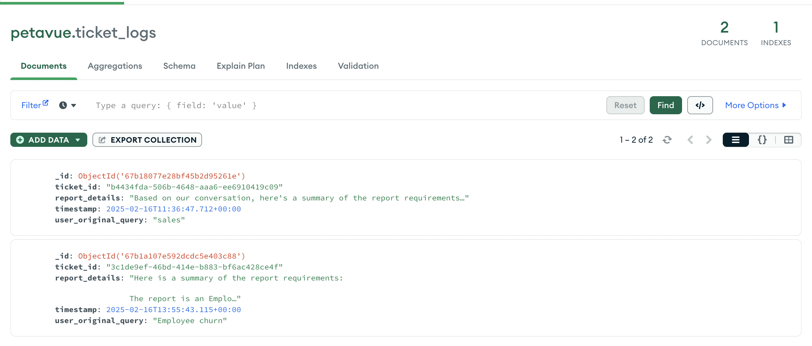

# Analytics Query Agent - Assignment

Design a sophisticated Customer Success Management (CSM) Analytics Query Agent that intelligently handles user requests for analytics reports, with advanced routing and problem-solving capabilities.

## Components

1. Weaviate VectorDB:  To store reports and their vector embeddings
2. Groq LLM: To interact with the user to fetch the report requirements
3. MongoDB: To store chat logs and tickets
4. SlackNotificationService: To publish a message in tickets channel in Slack APP via Webhook

## Execution Flow
1. User will query for a report with some text
2. App will try to fetch the relevant records from VectorDB using cosine similarity score
3. If user is not satisfied LLM Bot will pick up the flow and ask a set of questions to gather report requirements
4. Each interaction will be logged and stored in mongodb chat_logs collections
5. At the end ticket will be generated and Slack notification is triggered with necessary details.
6 The ticket generated will be stored in mongodb along with report requirements summary

## Setup
1. Setup MongoDB and VectorDB and Fill necessary enviromental variable in .env file
2. Setup python environmen and install depencdencies with below command
   ```
    poetry install
   ```
2. Run Weaviate VectorDB using docker-compose.yaml in the project with below command
    ```
   docker compose up -d
    ```
3. Load Sample Records in VectorDB using below command. This will load the records present in sample_data.py file into VectorDB
    ```
    python3 load_records.py
   ```
4. Run below command to start CLI app
    ```
    python3 app.py
   ```
   
## Execution Flow


   